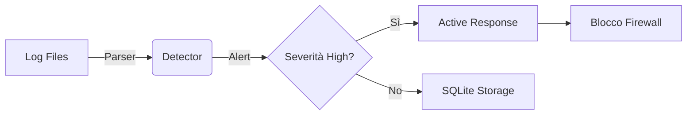

<div align="center">

```
    ██╗  ██╗███████╗██╗███╗   ███╗██████╗  █████╗ ██╗     ██╗     
    ██║  ██║██╔════╝██║████╗ ████║██╔══██╗██╔══██╗██║     ██║     
    ███████║█████╗  ██║██╔████╔██║██║  ██║███████║██║     ██║     
    ██╔══██║██╔══╝  ██║██║╚██╔╝██║██║  ██║██╔══██║██║     ██║     
    ██║  ██║███████╗██║██║ ╚═╝ ██║██████╔╝██║  ██║███████╗███████╗
    ╚═╝  ╚═╝╚══════╝╚═╝╚═╝     ╚═╝╚═════╝ ╚═╝  ╚═╝╚══════╝╚══════╝
```

### **Asgard Cybersecurity Suite** &mdash; Module I

<br/>


<br/>

> [!IMPORTANT]
> **Heimdall** è il primo modulo della **suite Asgard**. 
> Trasforma i log grezzi in **azioni difensive in tempo reale**.

</div>

---

### 🧠 Executive Summary
Heimdall non si limita a loggare: **reagisce**. Monitora i tentativi di intrusione (SSH brute-force, accessi Windows falliti) e attiva automaticamente il firewall locale per bloccare l'attaccante.



---

### 🚀 Caratteristiche Tecniche

| Modulo | Descrizione |
|:---|:---|
| 🔍 **Parser** | Regex engine per Linux/Windows log |
| 🛡️ **HIDS Core** | Detection engine basato su file YAML |
| 🧱 **Responder** | Blocco IP via `ufw`/`iptables`/`netsh` |
| 📊 **Dashboard API** | FastAPI per consultazione telemetria |

> [!TIP]
> Heimdall usa una **sliding window** temporale per evitare di bloccare utenti legittimi per errori di digitazione sporadici.

---

### 🛠️ Setup Rapido

```bash
git clone https://github.com/Fioru12/Heimdall.git
cd Heimdall
pip install -r requirements.txt

# Start demo
python main.py api & python run_local_demo.py
```

---

<div align="center">

**[Suite Asgard](https://github.com/Fioru12/Heimdall)** &middot; MIT License

</div>
